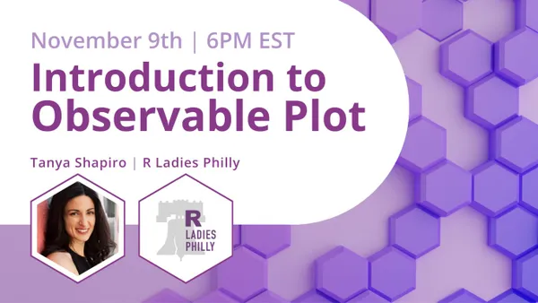

# Intro to Observable Plot

## Overview

This is an introductory talk covering a range of possibilities with Observable Plot From constructing simple plots, to layering in interactive components, to seeing it in action with Quarto - participants will get to sample a variety of Observable Plot applications.

The first section participants are invited to walk through an Observable Notebook analyzing Taylor Swift songs.

In the second section, participants will learn how they can integrate Observable Plot with Quarto (qmd) files using RStudio.

## Additional Resources

-   [Observable Notebook](https://observablehq.com/d/f002f055d6fa2f8d)

-   [Presentation](www.google.com)

-   [Quarto Dashboard Example](https://tashapiro.github.io/intro-observable/dashboard/dashboard.html)

**Note**: The Quarto Dashboard uses the pre-release version of Quarto, 1.4. To run this example, users will need to download this version.
